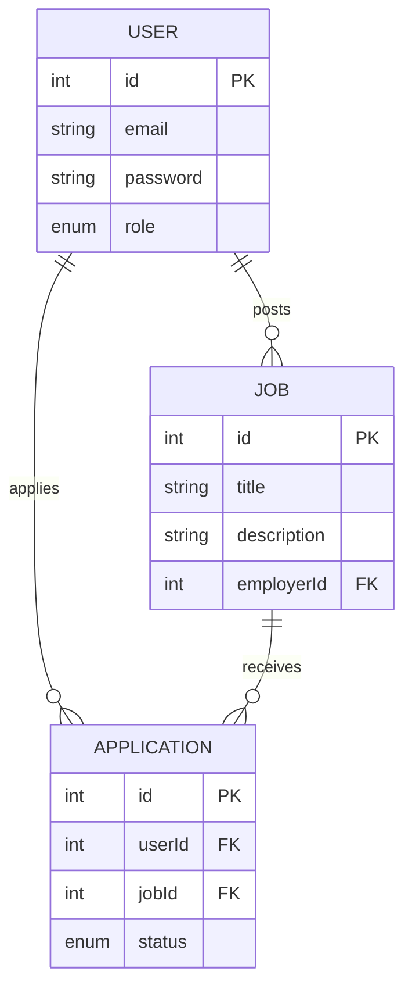

# 🚀 Job Portal API

> **RESTful Backend API** for a job marketplace platform, built with **Node.js**, **TypeScript**, and a clean **Layered Architecture** focusing on security and maintainability.


---

## 📖 About the Project

This project is a **backend simulation of a Job Portal system** (a lightweight version of LinkedIn / JobStreet) with a strong focus on:

* API security
* Complex relational data modeling
* Clear separation of responsibilities
* Non-trivial business logic

It is designed as a **backend portfolio project**, not just another CRUD application.

### 👥 System Roles

1. **Employer**

   * Create and manage job postings
   * View applicants (with ownership validation)
2. **Applicant**

   * Browse job listings
   * Apply for available jobs

---

## ✨ Key Features

### 🔐 Authentication & Authorization

* Secure login and registration using **JWT**
* Password hashing with **Bcrypt**
* Token-based authentication (Bearer Token)

### 🛡️ Role-Based Access Control (RBAC)

* Middleware-based access control by role:

  * `EMPLOYER`
  * `APPLICANT`

### 💼 Job Management

* Full CRUD operations for job postings
* Strong ownership relationship between jobs and employers

### 📝 Application System (Business Logic)

* Prevents **duplicate job applications**
* Application status validation
* Many-to-many relationship between Users and Jobs

### 👁️ Privacy & Ownership Validation

* **Only the job owner** can view applicants for a job
* Unauthorized access is automatically rejected

### 📐 Code Architecture

* **Controller Layer** → HTTP request & response handling
* **Service Layer** → Core business logic
* **Repository / Prisma Layer** → Database abstraction
* Clear separation of concerns for scalability

---

## 🛠️ Tech Stack

| Component          | Technology               |
| ------------------ | ------------------------ |
| Runtime            | Node.js                  |
| Language           | TypeScript (Strict Mode) |
| Framework          | Express.js               |
| Database           | MySQL                    |
| ORM                | Prisma                   |
| Authentication     | JWT + Bcrypt             |
| Environment Config | Dotenv                   |

---

## 🗄️ Database Design (ERD)

The system uses a **Many-to-Many** relationship between Users and Jobs via the Application table.



---

## 📂 Project Structure

```
src/
├── config/             # Environment & database configuration
├── controllers/        # HTTP layer (Request / Response)
│   ├── authController.ts
│   └── jobController.ts
├── services/           # Core business logic
│   ├── authService.ts
│   ├── jobService.ts
│   └── applicationService.ts
├── middlewares/        # Authentication, RBAC, validation
│   └── authMiddleware.ts
├── routes/             # API route definitions
│   ├── authRoutes.ts
│   └── jobRoutes.ts
├── types/              # Custom TypeScript types
└── server.ts           # Application entry point
```

---

## 🚀 Getting Started

### Prerequisites

* Node.js v16+
* MySQL (Laragon / XAMPP / Docker)

### 1️⃣ Clone the Repository

```bash
git clone https://github.com/YOUR_GITHUB_USERNAME/job-portal-api.git
cd job-portal-api
```

### 2️⃣ Install Dependencies

```bash
npm install
```

### 3️⃣ Environment Variables Setup

Create a `.env` file in the project root:

```env
PORT=3000
DATABASE_URL="mysql://root:@localhost:3306/job_portal_db"
JWT_SECRET="your_super_secure_secret"
```

### 4️⃣ Database Setup

```bash
npx prisma db push
```

### 5️⃣ Run the Server

```bash
npm run dev
```

The server will run at:

```
http://localhost:3000
```

---

## 🔌 API Endpoints

### 👤 Authentication

| Method | Endpoint           | Description              | Auth |
| ------ | ------------------ | ------------------------ | ---- |
| POST   | /api/auth/register | Register new user        | ❌    |
| POST   | /api/auth/login    | Login & get JWT          | ❌    |
| GET    | /api/auth/profile  | Get current user profile | ✅    |

### 💼 Jobs

| Method | Endpoint  | Description      | Auth         |
| ------ | --------- | ---------------- | ------------ |
| GET    | /api/jobs | Get all jobs     | ❌            |
| POST   | /api/jobs | Create a new job | ✅ (Employer) |

### 📝 Applications

| Method | Endpoint                 | Description     | Auth      |
| ------ | ------------------------ | --------------- | --------- |
| POST   | /api/jobs/:id/apply      | Apply for a job | ✅         |
| GET    | /api/jobs/:id/applicants | View applicants | ✅ (Owner) |

---

## 🔮 Future Improvements

* [ ] CV upload (file handling)
* [ ] Email notifications for new applications
* [ ] Unit & integration testing (Jest)
* [ ] Pagination and filtering

---

**Built to demonstrate real backend engineering skills**
